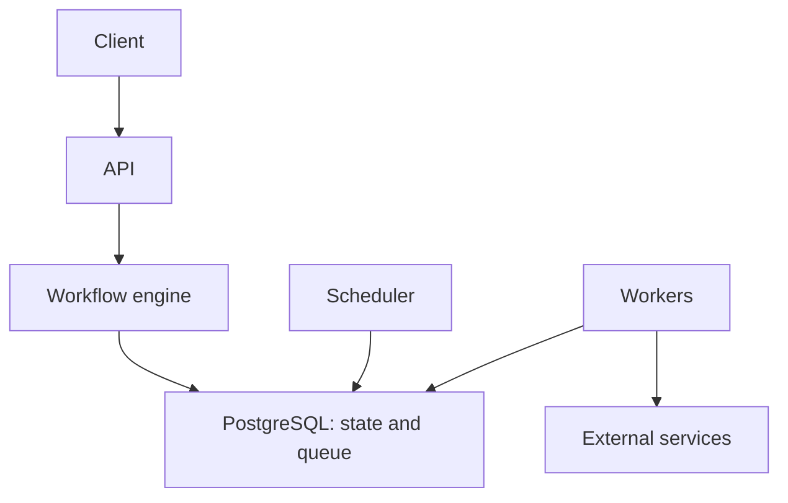

# Distributed Task Orchestrator: project context

## Goal

The orchestrator manages long-running processes: it persists state, identifies ready steps, dispatches them to executors, and resumes after failures. Example: `validate → resize_database → wait_replication`. The engine controls transitions; workers perform external actions.

The MVP architecture is a modular monolith in Go with PostgreSQL. One binary contains the API, engine, scheduler, and worker.

| Component | Responsibility |
| --- | --- |
| API | Definitions, workflow start and inspection, and external event ingestion |
| Engine | Dependencies, state transitions, and workflow completion |
| Queue | Atomic claim of READY tasks with leases |
| Worker | Activities, heartbeats, and result reporting |
| Scheduler | Expired leases, retries, timers, and deadlines |

## Guarantees

- PostgreSQL is the source of truth. Restart recovery uses persisted data; a transition must not exist only in memory.
- Claim uses a short transaction with `FOR UPDATE SKIP LOCKED`. The transaction commits before an external call.
- Leases and recovery provide **at-least-once execution**. Retrying after a crash can repeat an external effect; exactly-once effects are not promised.
- External calls use a stable logical-task idempotency key (`task_run_id`) across attempts. If the external service does not support a key, the activity checks whether the operation has already been applied.
- Heartbeats and result reports require the authoritative `attempt_id` fencing token, the lease owner, RUNNING state, and a valid lease. A stale worker's report is rejected even if its external call has already happened.
- With recovered infrastructure and a finite attempt limit or deadline, a workflow reaches a terminal state. External service success cannot be guaranteed.

## Invariants

1. A terminal workflow does not return to RUNNING without an explicit reset.
2. A SUCCEEDED task does not execute again without an explicit reset.
3. A task becomes READY only after all mandatory dependencies succeed.
4. A task has at most one valid stored lease; a stale attempt cannot write a result.
5. A task transition and its workflow reevaluation signal are written in one transaction.
6. Attempt numbers are unique within each task.

## MVP scope

Sequential workflows, durable state, multiple workers, leases and recovery, bounded retries, and attempt history. DAG execution, timers, and external events have separate roadmap stages. Kafka, a leader, Saga, replay, and a visual editor are outside MVP scope.

## Engineering constraints

Start every task on a new dedicated Git branch and finish it by opening a pull request. Follow the branch and PR requirements in [AGENTS.md](../../AGENTS.md).

Limit each PR to 500 changed business-logic lines; tests and documentation are excluded. Build reusable test doubles and mock time before running time-dependent scenarios. Write integration tests in Python against isolated, real PostgreSQL. Contract or data changes require updates to the affected references and `AGENTS.md` in the same PR.

See [code structure](02-code-structure.md), [data model](03-data-model.md), and [roadmap](04-roadmap.md).

The [MVP execution contract](../../docs/decisions/0001-mvp-contract.md) fixes provider-scoped immutable versions, finite attempt counters, run revisions, sequential value propagation, and HTTP errors. All execution-state writers acquire the workflow lock before wakeup/task/attempt locks; task completion and wakeup insertion remain atomic.
