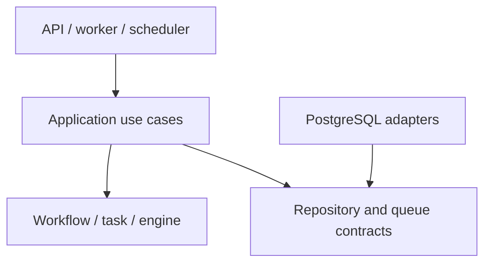

# Go code structure

Use one repository, one binary, and PostgreSQL. Domain and engine packages must not import HTTP, database drivers, or activity implementations. The application layer defines transaction boundaries.

```text
cmd/orchestrator/main.go
internal/
  workflow/           # immutable definitions, runs, state transitions
  task/               # task runs, attempts, retry policies, transitions
  engine/             # pure dependency evaluation
  application/        # transactional use cases
  queue/              # claim and lease contracts
  scheduler/          # recovery, retries, timers
  worker/             # registry, executor, heartbeat
  storage/postgres/   # SQL, transactions, repositories, queue
  api/http/           # endpoints and DTOs
  observability/      # logs, metrics, tracing
  config/
migrations/
tests/integration/    # Python integration tests against real PostgreSQL
tests/failure/       # Python process/crash and recovery scenarios
tests/support/       # reusable Python fixtures, mocks, clocks, process helpers
docs/
```

SQL queue implementation belongs in `storage/postgres` so claim rules are not duplicated. Create packages only when they have a concrete responsibility.



## Use cases and transactions

| Use case | Atomic action |
| --- | --- |
| `StartWorkflow` | Validate a definition, create a run and task_runs, enqueue a wakeup |
| `EvaluateWorkflow` | Lock the workflow then wakeup/tasks, read tasks, activate dependents, apply terminal transitions, delete the wakeup |
| `ClaimTasks` | Use `SKIP LOCKED`, create an attempt, set the fencing token and lease, commit before execution |
| `CompleteAttempt` | Validate the attempt and lease, write the result, close the attempt, enqueue a wakeup |
| `RecoverExpiredLeases` | Close the attempt, choose READY/RETRY_WAIT/FAILED, enqueue a wakeup |

The engine exposes pure functions such as `TransitionTask(task, event)` and `Evaluate(definition, taskRuns)`. They return changes or errors without calling the database or external services.

```go
type Payload struct {
    Value json.RawMessage
}

type Activity interface {
    Execute(ctx context.Context, input Payload, idempotencyKey string) (Payload, error)
}

type TaskQueue interface {
    Claim(ctx context.Context, workerID string, limit int) ([]ClaimedTask, error)
    Heartbeat(ctx context.Context, taskID, attemptID uuid.UUID, workerID string) error
}
```

`CompleteAttempt` also accepts `attemptID`. Checking only `lease_owner` is insufficient: the same worker identity can report an older attempt after a new claim.

## Time and reusable test support

GitHub Actions runs build, Go style (`gofmt` and `go vet`), and Go tests with race
detection and coverage percentages in test logs, without coverage report files
or uploads. Python tests are explicitly skipped while none exist.
When adding the Python harness, expose `make test-python` to install its pinned
dependencies, provision/clean up isolated PostgreSQL, and execute the integration
and failure suites. Align the workflow's Python version with the harness pin.
The CI gate must fail if tests exist but the harness command is absent or fails.

Inject time into time-dependent business logic. Configure reusable fake clocks before constructing the tested component, including its timers and tickers; explicitly advance time in assertions. Inject deterministic randomness for jitter. Pure functions can accept an explicit instant rather than reading a clock.

Keep PostgreSQL authoritative for production lease and deadline decisions. Python integration fixtures must configure a controlled database-time seam before a temporal scenario, align it with the application's clock, and reset both between tests. Test-only time controls must not be exposed by production configuration or public endpoints.

Use Go for unit tests and Python for integration and failure tests. Share reusable mocks, fake external services, database fixtures, and process/barrier helpers. Do not replace real database transactions or locks with mocks. Use bounded wall-clock timeouts only to detect a hung test, not to determine a business outcome.

Contract and data changes must update the affected references and `AGENTS.md` in the same PR.

## MVP contract boundary

Follow the [MVP decision](../../docs/decisions/0001-mvp-contract.md) for named records, payload handling, HTTP errors, state transitions, and workflow-first lock order. All existing execution-state writers lock the workflow before wakeup/task/attempt rows, recheck discovered candidates, and increment the run revision once when changing run/task/attempt data. Claims use one workflow per transaction; leases and attempt fencing exist from stage 1. Activity JSON is an opaque named payload at the orchestrator boundary and validated into activity-specific types by adapters.

## Immutable definition interface

`internal/workflow` validates and copies definition inputs into immutable snapshots.
`definition.go` holds types, construction, and accessors; `validation.go` checks
metadata, policies, dependencies, cycles, and sequence eligibility.
`Tasks` returns detached copies in declaration order. `ValidateSequence` gates
execution to a single chain until stage 5.
