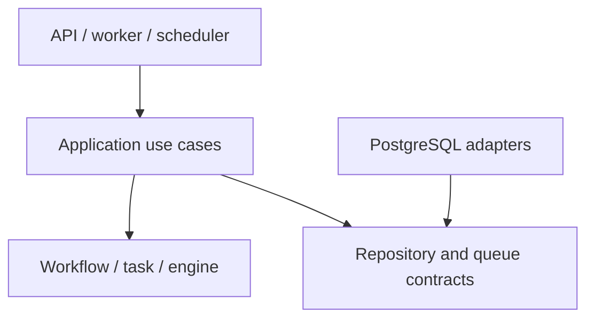

# Go code structure

Use one repository, one binary, and PostgreSQL. Domain and engine packages must not import HTTP, database drivers, or activity implementations. The application layer defines transaction boundaries.

```text
cmd/orchestrator/main.go
internal/
  workflow/           # immutable definitions, runs, state transitions
  task/               # task runs, attempts, retry policies, transitions
  engine/             # pure dependency evaluation
  services/           # application use cases, grouped by domain
  repositories/       # persistence adapters, grouped by domain
  queue/              # claim and lease contracts
  scheduler/          # recovery, retries, timers
  worker/             # registry, executor, heartbeat
  storage/postgres/   # bootstrap, migrations, database clock, queue SQL
  api/http/           # endpoints and DTOs
  observability/      # logs, metrics, tracing
  config/
migrations/
tests/integration/    # Python integration tests against real PostgreSQL
tests/failure/       # Python process/crash and recovery scenarios
tests/support/       # reusable Python fixtures, mocks, clocks, process helpers
docs/
```

SQL queue implementation belongs in `storage/postgres` so claim rules are not duplicated. Create packages only when they have a concrete responsibility.



## Use cases and transactions

| Use case | Atomic action |
| --- | --- |
| `StartWorkflow` | Validate a definition, create a run and task_runs, enqueue a wakeup |
| `EvaluateWorkflow` | Lock the workflow then wakeup/tasks, read tasks, activate dependents, apply terminal transitions, delete the wakeup |
| `ClaimTasks` | Use `SKIP LOCKED`, create an attempt, set the fencing token and lease, commit before execution |
| `CompleteAttempt` | Validate the attempt and lease, write the result, close the attempt, enqueue a wakeup |
| `RecoverExpiredLeases` | Close the attempt, choose READY/RETRY_WAIT/FAILED, enqueue a wakeup |

The engine exposes pure functions such as `TransitionTask(task, event)` and `Evaluate(definition, taskRuns)`. They return changes or errors without calling the database or external services.

```go
type Payload struct {
    Value json.RawMessage
}

type Activity interface {
    Execute(ctx context.Context, input Payload, idempotencyKey string) (Payload, error)
}

type TaskQueue interface {
    Claim(ctx context.Context, workerID string, limit int) ([]ClaimedTask, error)
    Heartbeat(ctx context.Context, taskID, attemptID uuid.UUID, workerID string) error
}
```

`CompleteAttempt` also accepts `attemptID`. Checking only `lease_owner` is insufficient: the same worker identity can report an older attempt after a new claim.

## Time and reusable test support

GitHub Actions runs build, Go style (`gofmt` and `go vet`), and Go tests with race
detection and coverage percentages in test logs, without coverage report files
or uploads. `make test-python` runs both Python suites with pinned dependencies
and disposable PostgreSQL/Python services from `docker-compose.test.yml`; missing
prerequisites fail the gate. Each run uses its own Compose project and cleanup.
See [development commands](../../README.md#development-commands) for isolation
and cleanup. Shared fixtures in `tests/conftest.py` provide database lifetimes,
bounded Go process execution and aligned application/database clock control.

Inject time into time-dependent business logic. Configure reusable fake clocks before constructing the tested component, including its timers and tickers; explicitly advance time in assertions. Inject deterministic randomness for jitter. Pure functions can accept an explicit instant rather than reading a clock.

Keep PostgreSQL authoritative for production lease and deadline decisions. Python integration fixtures must configure a controlled database-time seam before a temporal scenario, align it with the application's clock, and reset both between tests. Test-only time controls must not be exposed by production configuration or public endpoints.

Use Go for unit tests and Python for integration and failure tests. Share reusable mocks, fake external services, database fixtures, and process/barrier helpers. Do not replace real database transactions or locks with mocks. Use bounded wall-clock timeouts only to detect a hung test, not to determine a business outcome.

Contract and data changes must update the affected references and `AGENTS.md` in the same PR.

## MVP contract boundary

Follow the [MVP decision](../../docs/decisions/0001-mvp-contract.md) for named records, payload handling, HTTP errors, state transitions, and workflow-first lock order. All existing execution-state writers lock the workflow before wakeup/task/attempt rows, recheck discovered candidates, and increment the run revision once when changing run/task/attempt data. Claims use one workflow per transaction; leases and attempt fencing exist from stage 1. Activity JSON is an opaque named payload at the orchestrator boundary and validated into activity-specific types by adapters.

## Immutable definition interface

`internal/workflow` validates and copies definition inputs into immutable snapshots.
`definition.go` holds types, construction, and accessors; `validation.go` checks
metadata, policies, dependencies, cycles, and sequence eligibility.
`Tasks` returns detached copies in declaration order. `ValidateSequence` gates
execution to a single chain until stage 5.

## Task transition interface

[`internal/task`](../../internal/task/transition.go) keeps task and attempt outcomes
consistent. The engine owns dependency eligibility; the application owns workflow
guards, fencing and atomic persistence.

## Sequential evaluation

[`internal/engine`](../../internal/engine/evaluate.go) proposes sequence progress.
Callers supply a complete snapshot under the workflow lock and own payload
propagation and persistence; evaluation performs no I/O.

## Database bootstrap

`config.Load` requires `DATABASE_URL`; `DATABASE_TIMEOUT` bounds `db-check` and
`migrate` (default 10 seconds, at most one minute). `storage/postgres` owns the
pgx `database/sql` pool, Goose migration provider and database time query. The production
CLI embeds migrations and has no test-clock configuration. The separate Go probe
under `tests/support` is built only for integration scenarios.

## Definition publication

[`definitions.Service`](../../internal/services/definitions/service.go) owns validation
and a single atomic append boundary; the [repository](../../internal/repositories/definitions/repository.go) performs that append
in one statement. Concurrent duplicate identities report a conflict without
overwriting history. Reads select an exact tuple and revalidate stored content. Repository SQL lives
in adjacent embedded files.

## Workflow start

[`workflows.Service`](../../internal/services/workflows/service.go) owns the start
transaction through a repository transaction interface. Definition reads may
precede it because publication is immutable; all execution writes use the same
READ COMMITTED transaction. The [adapter](../../internal/repositories/workflows/repository.go)
has no activity calls or execution loops.
